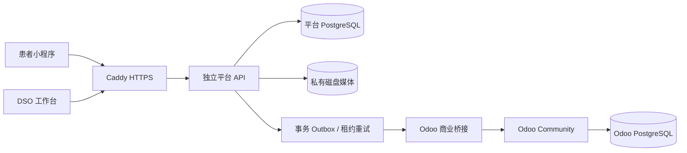

# 花栗鼠 / Smilelab DSO

开发与演示环境已提供小程序后端、医生/门诊/咨询/运维工作台及独立 Odoo 商业后台。新平台位于 `platform/`，旧 `api/Admin.Api` 保留；本仓库的人工初始化约定仍适用于旧服务，自动任务不运行其 `--init`。

| 入口 | 地址 |
|---|---|
| DSO 员工工作台 | https://app.smilelab.ai/workspace/ |
| API 文档 | https://app.smilelab.ai/api/docs |
| OpenAPI 3 | https://app.smilelab.ai/api/openapi.json |
| Odoo Community 19 | https://odoo.smilelab.ai |

登录凭据独立私有交付，不在仓库中。工作台默认简体中文，可切换英语。演示患者、员工和管理员凭据互相隔离；真实微信、短信、支付和 AI 尚未配置。



临床档案、医生授权、照片和 AI 作业归平台；Odoo 接收商业引用，承担 CRM、销售、采购、库存、HR 和会计模块。当前仅新建线索单向同步，阶段及跟进不双向同步。财务本地化和真实业务配置仍需另行准备。

## 源码与开发

- `platform/`：.NET 10、Npgsql/PostgreSQL，版本迁移、临床/预约/CRM、媒体、模拟 AI、集成运维。
- `backend/`：Vue 3、Ant Design Vue、FullCalendar 标准插件的 DSO 工作台。
- `packages/smilelab-client/`：浏览器 TypeScript SDK，以及 `./uni` 原生 UniApp/微信请求和文件上传适配。
- `odoo/addons/chipmunk_bridge/`：商业事件、重放保护与管理员维护的租户—公司映射。
- `app/`、`doctor/`：保留占位目录；本轮没有完成患者小程序 UI。
- `tools/`：契约生成、独立员工凭据配置、只读容量测量和备份恢复检查。

```bash
npm ci --ignore-scripts
npm run test --workspace @smilelab/client
npm run build
python tools/generate-openapi.py
docker build -f platform/Dockerfile.full -t chipmunk-platform:dso-candidate .
python platform/tests/dso_integration.py --image chipmunk-platform:dso-candidate
python platform/tests/odoo_integration.py
```

浏览器测试需要隔离数据库交付的临时凭据，不能直接用真实患者或管理员账号运行。`platform/tests/dso_integration.py --ui-handoff <私有路径> --hold-seconds 600` 保留合成测试栈；把该文件路径传给 `DSO_TEST_CREDENTIALS`，将其 apiBase 传给 `SMILELAB_TEST_URL`，运行 `npm run test:ui`，然后创建同名前缀的 `.done` 文件释放容器。CI 自动完成这一过程，并仅上传合成截图和统计报告。

## 文档

- [DSO 开发接口、权限和工作流](doc/Smilelab_DSO开发接口与工作流.md)
- [小程序 API 开发文档](doc/Smilelab小程序API开发文档.md)
- [复用项目、许可与组件决策](doc/DSO复用项目评估与组件决策.md)
- [容量采样与运行边界](doc/Smilelab_DSO容量与运行边界.md)
- [第三方许可说明](THIRD_PARTY_NOTICES.md)

基础设施由独立 `dcad-infra` 仓库管理 Compose、Caddy、发布与备份；不能直接改服务器配置。部署从已测试的产品提交打包，保存旧数据库、文件、源码及镜像后升级。平台 API 和 Odoo 不发布主机端口，数据库不进入反向代理网络。

恢复工具只在临时目标验证：`tools/verify-backup.py` 校验两库恢复及快照文件；`tools/verify-stack-restore.py --snapshot <完整快照目录>` 从快照启动完整隔离 API/Odoo 栈，检查管理员登录、五个员工角色、商业桥接、工作台和媒体字节哈希。当前验证在同一 VPS，不能替代异地备份或替代主机演练。
