# 数据库关系图与模块关系图

版本：V1.0
日期：2026-09-08
配套：`07_数据库设计_DDL_V1.sql`（表结构源头）、`05_M0详细设计.md`（模块与插件契约）、`03_小程序平台架构设计.md`（架构总纲）、`06_阿里云基础设施部署手册.md`（部署拓扑）

图用 Mermaid 编写，GitHub、飞书文档与 Claude Code 均可直接渲染。所有关系均由脚本从 DDL 机械提取后人工分类，不是凭印象画的。

---

## 0. 图例与统计

### 0.1 关系类型

| 记号 | 含义 | 数量 |
| --- | --- | --- |
| 实线 | 显式外键，DDL 里写了 `REFERENCES`，数据库保证引用完整性 | 26 |
| 虚线 | 逻辑引用，只存对方 ID 没有外键，完整性由服务层保证 | 54 |
| 虚线加问号 | 多态引用，指向哪张表由 `target_type` / `biz_type` 决定 | 5 |

逻辑引用 54 条的构成：30 条跨 schema（架构规定禁止跨 schema 外键，属设计内），19 条同 schema 内本可建外键却没建（见 §8 复核清单），5 条多态引用。

外键在各 schema 的分布很不均衡，这本身是一条值得注意的信号：

| schema | identity | assess | content | ai | ops | care | msg |
| --- | --- | --- | --- | --- | --- | --- | --- |
| 外键数 | 13 | 6 | 6 | 1 | **0** | **0** | **0** |

**扫描口径**：先按 `_id` 结尾扫出 87 列，再补扫 `_by` 结尾与业务键列，又找出 4 个引用列（`user_role.granted_by`、`report.doctor_edited_by`、`app_config.updated_by`、`doctor_profile.scene_key`）。只按 `_id` 扫会漏掉「谁操作了什么」这一族。

另有 11 个以 `_id` 结尾但并非实体引用的字段不在图上：设备串 4 个、插件与任务的外部系统 ID 4 个、链路追踪 ID 1 个、消息服务商模板 ID 2 个。

### 0.2 Mermaid 基数记号

| 记号 | 读法 |
| --- | --- |
| `\|\|--o{` | 左侧恰好一条，右侧零到多条 |
| `\|\|--\|{` | 左侧恰好一条，右侧一到多条 |
| `\|o--o{` | 左侧零或一条（来源列可空），右侧零到多条 |
| `\|\|--o\|` | 一对一，右侧可选 |
| `}o--o{` | 多对多 |

### 0.3 表分布

| schema | 表数 | 里程碑 | 职责 |
| --- | --- | --- | --- |
| identity | 10 | M1 | 用户、角色、偏好、机构、医生、认证、疗程、疗程事件、二维码、邀请 |
| assess | 8 | M1 | 问卷模板、题目、选项、作答、答案、报告、照片、AI 模拟记录 |
| content | 9 | M1 | 帖子、媒体、案例扩展、评论、互动、关注、话题、帖子话题、审核 |
| ai | 4 | M1 | 插件注册、任务、结果、计量 |
| ops | 8 | M1 | 配置、协议、同意记录、文件登记、消息模板、Banner、审计、短信 |
| care | 5 | M2 | 佩戴周期、打卡、评分、换套任务、监控照片 |
| msg | 3 | M2 | 会话、消息、通知 |
| trade | 0 | M3 | 订单与供应链，仅建 schema |
| growth | 0 | M3 | 积分与裂变，仅建 schema |
| **合计** | **47** | | M1 执行 39 张，M2 注释块内 8 张 |

`care` 与 `msg` 的八张表包在 DDL 第七节的 `/* */` 块注释里，执行 M1 的脚本后一张都不会创建。`trade` 与 `growth` 只有 `CREATE SCHEMA`，零张表。所以「39」是 M1 真正落地的表数，「47」是九个 schema 已设计的表数，两个数字在不同语境下都会用到，不要混。

---

## 1. 数据库总览：schema 边界与跨域引用

这张图只画每个 schema 的核心实体和跨 schema 的引用。它要回答的问题是：域与域之间到底靠什么串起来。答案是两个中心，`app_user` 和 `course`，几乎所有跨域引用都指向它们。

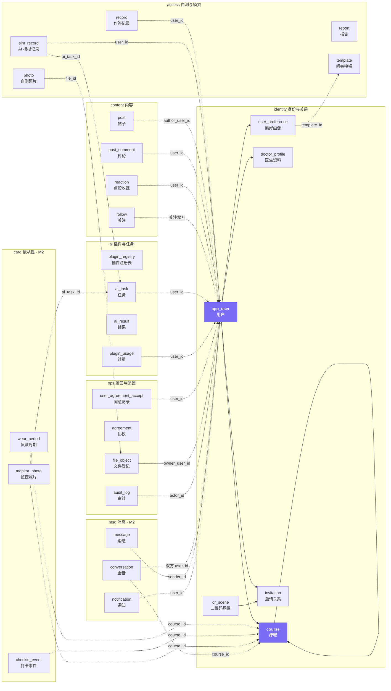

实线是同 schema 内的外键，虚线是跨 schema 的逻辑引用。30 条跨域引用的去向分布如下，`app_user` 与 `course` 合计占 26 条，是整个库的枢纽，任何涉及它们的变更都要评估全域影响。

| 被指向的表 | 条数 |
| --- | --- |
| `identity.app_user` | 20 |
| `identity.course` | 6 |
| `ai.ai_task` | 2 |
| `assess.template` | 1 |
| `ops.file_object` | 1 |

注意方向：`identity` 几乎只被别人依赖，唯一一条从 `identity` 主动指向外域的是 `user_preference.template_id` 指向 `assess.template`。`trade` 与 `growth` 两个 schema 目前零张表，图上不出现，M3 才落地。

---

## 2. identity 详图：身份与关系

这个 schema 承载了项目最核心的业务规则：疗程是医患关系的唯一单位，裂变最多两层且必须挂靠医生。

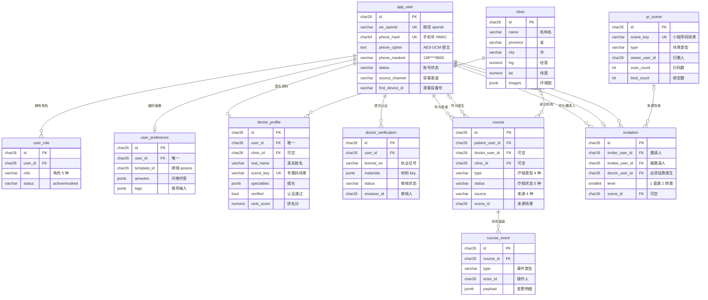

**由索引与约束兜住的业务规则**

| 规则 | 实现 |
| --- | --- |
| 同一患者与同一医生同时只能有一个进行中疗程 | `course` 上的部分唯一索引，条件为 `status IN ('consulting','active','retention')` |
| 一个用户只能被邀请一次 | `invitation` 上 `invitee_user_id` 的部分唯一索引，条件为 `status='valid'` |
| 裂变不超过两层 | `CHECK (level IN (1,2))`，第三层由服务层在写入前拒绝 |
| 不能邀请自己 | `CHECK (inviter_user_id <> invitee_user_id)` |
| 一个用户一种角色只有一条记录 | `user_role` 上 `(user_id, role)` 唯一索引 |
| 手机号与 openid 全局唯一且软删除后可复用 | 带 `deleted_at IS NULL` 条件的部分唯一索引 |

`app_user` 与 `course` 之间有两条关系，分别以患者和医生身份连接，这是医患多对多的建模方式。换医生等于结束当前疗程另开一条，历史数据全部保留。

---

## 3. assess 详图：自测与 AI 模拟

问卷模板用 `kind` 字段区分自测与注册偏好问卷，复用同一套题目结构，避免两套几乎一样的表。

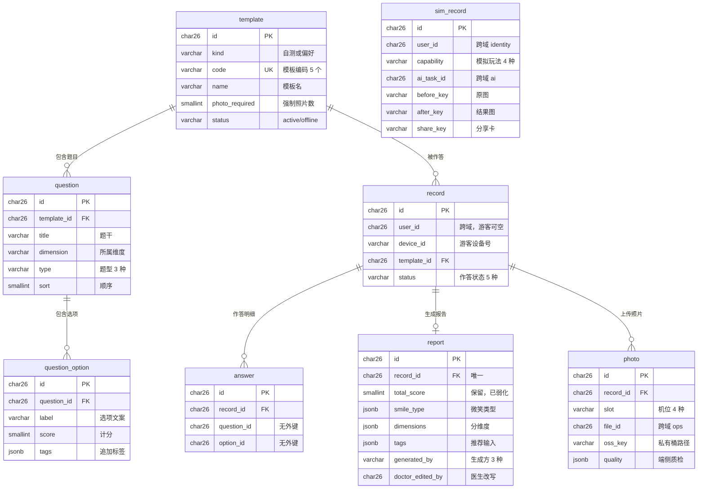

`sim_record` 与其他七张表没有连线，它挂在 `ai.ai_task` 上，是引流小游戏的业务侧记录。游客也能用，所以 `user_id` 可空，靠 `device_id` 追踪，登录后认领。

`record` 与 `photo` 之间有 `(record_id, slot)` 唯一索引，保证一个记录每个机位只有一张照片，重传是覆盖而不是追加。

---

## 4. content 详图：内容与互动

九月三日决定把科普、案例、牙套日记、互助合并成一个小红书式信息流，所以这里只有一张 `post` 主表，靠 `type` 和 `author_role` 区分，医生案例用 `case_detail` 扩展模板字段。表较多，拆成两张图。

### 4.1 帖子、媒体与话题

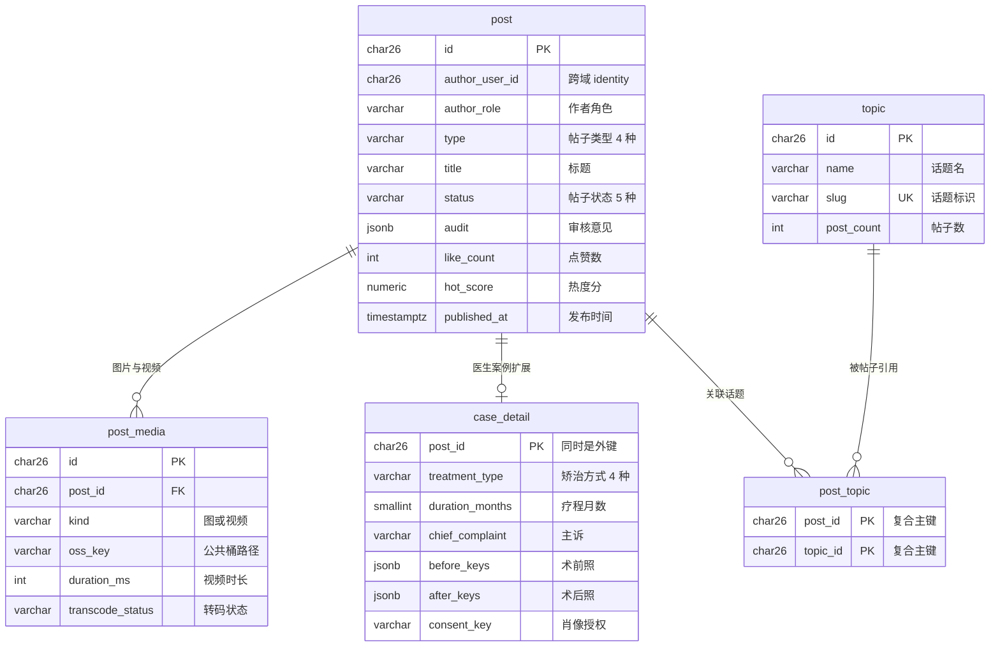

### 4.2 互动与审核

`post` 在这里只画成空框表示连接点，属性见上一张图。

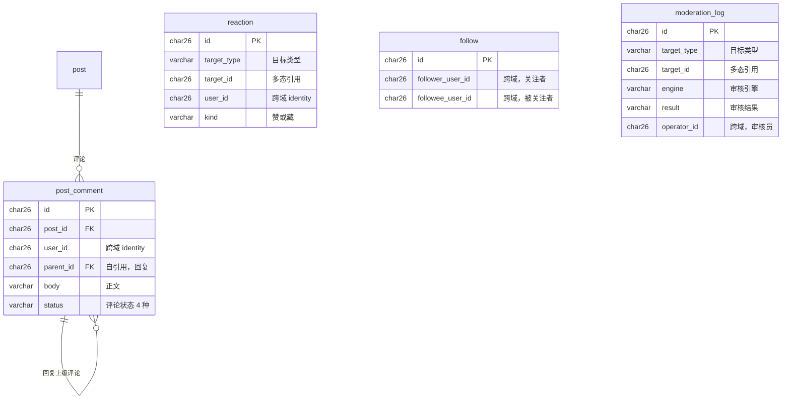

`reaction` 和 `moderation_log` 是多态引用，靠 `target_type` 决定 `target_id` 指向帖子还是评论，因此无法建外键，也画不进 ER 图的连线里。服务层必须自己保证目标存在。

`follow` 的两个字段都指向 `identity.app_user`，是同一张表的两个角色，加上 `CHECK (follower <> followee)` 防止自己关注自己。

**帖子与评论的审核策略是相反的**，这一点藏在默认值里，画图时容易被抹平：

| 表 | `status` 默认值 | 含义 |
| --- | --- | --- |
| `content.post` | `pending` | 先审后发，帖子要过审才出现在信息流 |
| `content.post_comment` | `published` | 发后审，评论直接可见，命中风险后再改判 |

这是两条不同的产品决策，实现审核链路时要分两支处理，不能共用一套状态机。

---

## 5. ai 详图：插件注册与任务编排

这是「平台是整合者」这条架构决策的落地处。插件可开关、可灰度、可按能力切换实现，业务代码不认具体供应商。

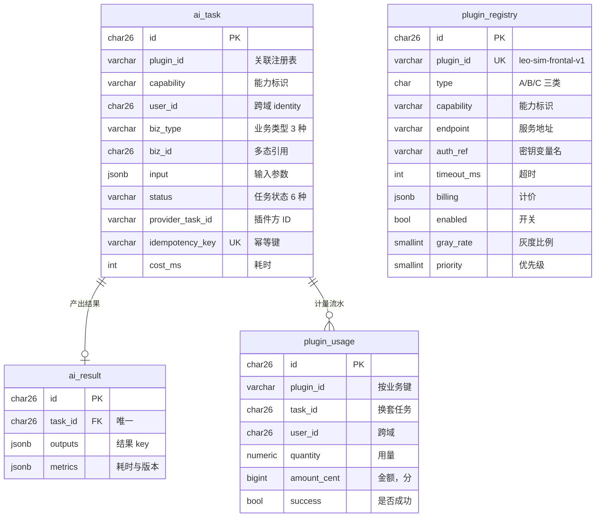

`ai_task.plugin_id` 关联的是 `plugin_registry.plugin_id` 这个业务键而不是主键，所以建不了外键。这么设计是为了让任务记录在插件下线后仍能读懂用了哪个实现。

`ai_task.biz_id` 是多态的：`biz_type='sim'` 时指向 `assess.sim_record`，`biz_type='assess_report'` 时指向 `assess.record`，M2 加入 `monitor_compare` 后指向 `care.monitor_photo`。

---

## 6. ops 详图：配置、协议、文件与审计

这个 schema 里的表彼此几乎不相连，它们各自服务于一类横切关注点。八张表拆成两组画。

### 6.1 配置、协议与消息模板

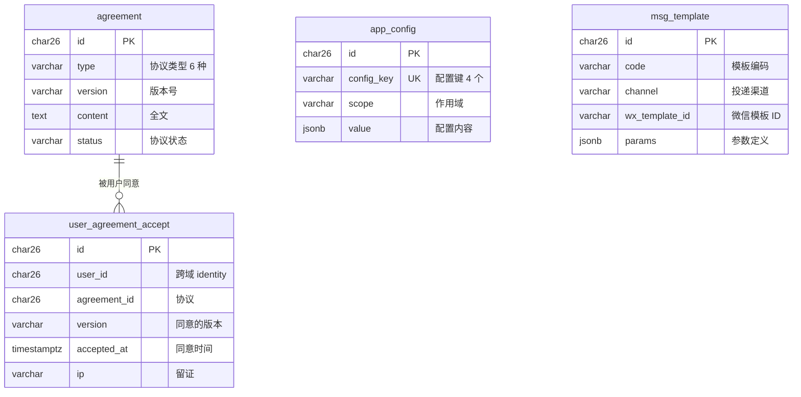

### 6.2 文件、广告与日志

这四张表互不相连，各自独立。

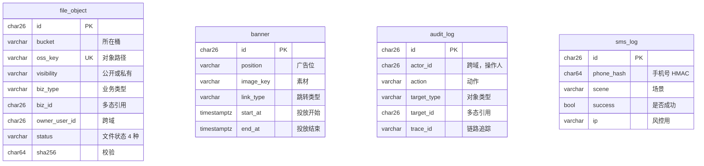

`file_object` 是所有 OSS 对象的唯一账本。任何上传都要在这里登记，直传回调写入 `uploaded`，超时未回调的留在 `pending`，定时任务据此清理孤儿文件。`assess.photo.file_id`、`content.post_media.oss_key`、医生认证材料都指回这里。

`audit_log.actor_id` 故意不建外键：审计记录必须比用户账号活得更久，用户注销后审计不能跟着消失。

---

## 7. care 与 msg 详图：依从性与消息（M2）

这两个 schema 在 DDL 文件第七节的注释块里，M2 开始前单独执行。当前**一条外键都没有**，全部是逻辑引用，这一点见 §8 的复核意见。

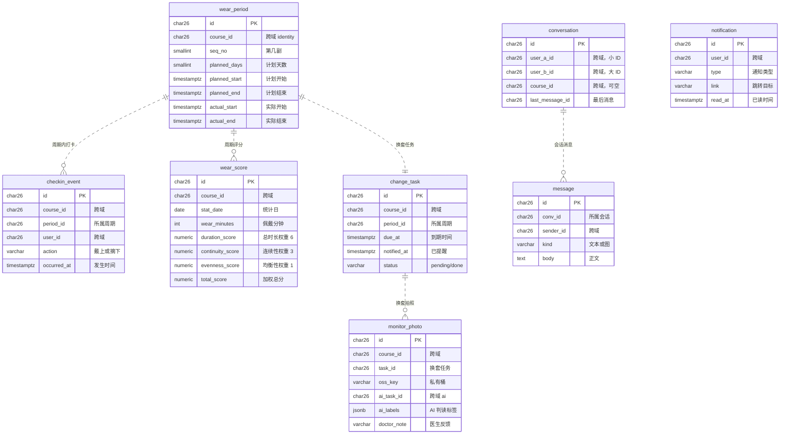

`conversation` 上有 `CHECK (user_a_id < user_b_id)` 和 `(user_a_id, user_b_id)` 唯一索引，靠有序存放保证两个人之间只有一条会话，不会因为发起方不同产生两条。

佩戴评分的三项权重来自九月二日会议：总时长六成、连续性三成、均衡性一成。

---

## 8. 数据库设计复核清单

画图过程中机械比对了全部 87 个以 `_id` 结尾的列，有两类问题值得在 M0 收尾前定夺。

### 8.1 同 schema 内本可建外键却没建的 19 条

| 表与列 | 应指向 | 判断 |
| --- | --- | --- |
| `identity.doctor_profile.scene_key` | `identity.qr_scene.scene_key` | 建议补，两侧都有唯一索引，外键在语法上成立；若医生资料先于二维码创建则改为服务层校验 |
| `identity.user_role.granted_by` | `identity.app_user` | **保持无外键**，授予人账号注销后授权记录要留存 |
| `assess.answer.question_id` | `assess.question` | **建议补外键**，答案指向不存在的题目是脏数据 |
| `assess.answer.option_id` | `assess.question_option` | **建议补外键**，同上 |
| `ops.user_agreement_accept.agreement_id` | `ops.agreement` | **建议补外键**，合规留证不能指向不存在的协议 |
| `identity.course.scene_id` | `identity.qr_scene` | 建议补，可空外键无副作用 |
| `identity.app_user.source_scene_id` | `identity.qr_scene` | 建议补 |
| `identity.qr_scene.owner_user_id` | `identity.app_user` | 建议补 |
| `care.checkin_event.period_id` | `care.wear_period` | M2 建表时补 |
| `care.wear_score.period_id` | `care.wear_period` | M2 建表时补 |
| `care.change_task.period_id` | `care.wear_period` | M2 建表时补 |
| `care.monitor_photo.task_id` | `care.change_task` | M2 建表时补 |
| `msg.message.conv_id` | `msg.conversation` | M2 建表时补 |
| `msg.conversation.last_message_id` | `msg.message` | 循环引用，**保持无外键**，否则插入顺序死锁 |
| `identity.doctor_verification.reviewer_id` | `identity.app_user` | **保持无外键**，审核人账号注销后记录要留存 |
| `identity.course_event.actor_id` | `identity.app_user` | **保持无外键**，同上 |
| `ai.ai_task.plugin_id` | `ai.plugin_registry.plugin_id` | **保持无外键**，关联业务键非主键，插件下线后任务仍可读 |
| `ai.plugin_usage.plugin_id` | `ai.plugin_registry.plugin_id` | **保持无外键**，理由同上 |
| `ai.plugin_usage.task_id` | `ai.ai_task` | 建议补，计量流水应有归属 |

结论：建议补 13 条，保持现状 6 条且每条都有明确理由。这些是 `ALTER TABLE ADD CONSTRAINT` 级别的改动，在 M0 建库前改成本为零，上线后再改要停机。

「谁操作了什么」这一族有六列指向 `app_user` 却一律不建外键：`user_role.granted_by`、`doctor_verification.reviewer_id`、`course_event.actor_id`、`assess.report.doctor_edited_by`、`content.moderation_log.operator_id`、`ops.app_config.updated_by`，再加上 `ops.audit_log.actor_id`。理由一致：留痕要比账号活得久。建议把这条理由写进 DDL 注释，否则后来者会当成疏漏去补。

### 8.2 文件与业务之间存在三套并行的关联机制，且没说以哪套为准

这是画图过程中发现的最需要在 M1 编码前定夺的一条。全库共有 21 处列持有 OSS 对象的 key，但它们与文件账本 `ops.file_object` 的关联方式并不统一：

| 机制 | 用法 | 出现处 |
| --- | --- | --- |
| 正向存 ID | 存 `file_id` 指向 `file_object.id` | **只有 `assess.photo` 一处** |
| 存 key 字符串 | 只存 `oss_key` / `cover_key` / `avatar_key` 等，靠字符串匹配 | 其余 20 处 |
| 反向多态 | `file_object` 用 `biz_type` + `biz_id` 指回业务对象 | 由文件账本一侧发起 |

三个后果必须正视。第一，`file_object` 的唯一键是复合的 `(bucket, oss_key)`，单靠 `oss_key` 字符串定位不到唯一行，同一个 key 可以在公共桶和私有桶各存一行。第二，孤儿文件清理依赖账本登记，但只存 key 字符串的那 20 处无法反查是否登记过。第三，`content.case_detail.before_keys` / `after_keys` 与 `ai.ai_result.outputs` 把 key 藏在 JSONB 数组里，任何基于列的扫描都看不到它们。

建议在 M0 内定一条规则并写进 ADR：所有业务表一律存 `file_id`，展示时由服务层解析为签名 URL；或者一律只存 key，由 `file_object` 的 `biz_type` + `biz_id` 单向反查。两条路都行，并行三套不行。

### 8.3 ops 是零约束区

全库 26 条外键的分布是 identity 13、assess 6、content 6、ai 1、ops 0、care 0、msg 0。`ops` 的八张表一条 `REFERENCES` 都没有。其中 `user_agreement_accept.agreement_id` 属于 §8.1 的建议补列，而这张表真正的去重维度是 `(user_id, type, version)` 的唯一索引，与 `agreement_id` 并不同步，等于同一件事有两套标识。合规留证链条上出现这种不一致，值得单独确认。

### 8.4 M2 预建块的四个共性缺陷

`care` 与 `msg` 的八张表整块在 `/* */` 注释里，执行 M1 的 DDL 后一张都不会创建。这个块相比 M1 各 schema 缺了四样东西：

| 缺什么 | 现状 | M2 建表时的处理 |
| --- | --- | --- |
| 外键 | 0 条 | 同 schema 内按 §8.1 补齐 |
| 软删除 | 8 张表全部没有 `deleted_at` | 至少 `monitor_photo` 与 `message` 需要 |
| 更新触发器 | 3 张表有 `updated_at` 却没有触发器 | `wear_period`、`change_task`、`conversation` 三张要补 |
| 枚举约束 | 整块只有 2 个 `CHECK` | 状态列都应加 |

不影响 M1，但必须写进 M2 的建表任务，否则容易照抄现状。

### 8.5 多态引用需要服务层兜底，且约束还不对称

五处多态引用（`content.reaction.target_id`、`content.moderation_log.target_id`、`ai.ai_task.biz_id`、`ops.file_object.biz_id`、`ops.audit_log.target_id`）数据库无法约束，服务层写入前必须校验目标存在，删除目标时必须级联清理。建议统一封装一个多态引用校验器，不要每处各写一遍。

约束还不一致：`reaction.target_type` 有 `CHECK (target_type IN ('post','comment'))`，而 `moderation_log.target_type` 与 `audit_log.target_type` 连注释枚举都没固化成约束。同一种多态模式三种写法，建议统一。

另外 `ai.ai_task.biz_type` 的注释写的是 `sim|assess_report|monitor_compare`，但 `assess_report` 到底指向 `assess.record` 还是 `assess.report`，DDL 里没有任何地方说明。这个映射要在编码前明确。

---

## 9. 系统分层总图

从用户点开小程序到数据落地，整条链路经过哪些部件。

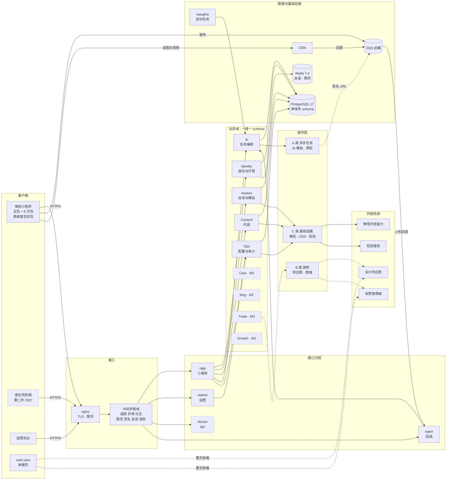

虚线框的部件属于第二或第三阶段，M1 只建空壳。

---

## 10. 后端模块依赖与 schema 映射

模块边界是这套架构最重要的约束。两人团队最容易犯的错是图省事跨域直接查表，一旦发生，将来拆服务就拆不动了。

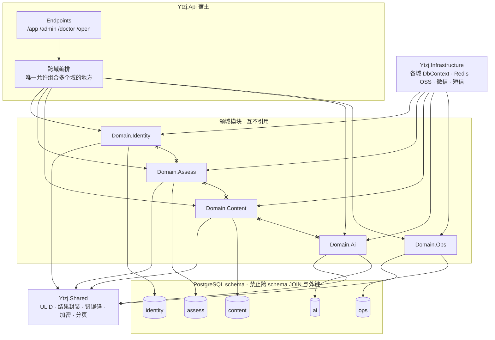

Mermaid 画不出「禁止」这种反向语义，所以规则单独列出：

| 规则 | 说明 |
| --- | --- |
| 领域模块之间不得互相引用 | 需要对方数据时在宿主层编排，或发领域事件 |
| 领域模块只能引用 Shared | Infrastructure 可以引用所有领域，因为要放各自的 DbContext |
| 一个领域模块对应且只对应一个 schema | `HasDefaultSchema("x")` |
| 跨域查询返回 DTO 不返回实体 | 如 `IIdentityQuery.GetUserBrief(ids)` |
| 禁止跨 schema JOIN | 违反时 schema 隔离形同虚设，将来拆库拆不动 |

拆成独立物理库的触发条件：单域超 5000 万行、单域 QPS 超实例四成、需要独立备份周期或独立合规审计、团队增至四人以上分域负责。满足任一条就用 `pg_dump -n schema` 把该域搬走。

---

## 11. 插件集成三类协议

九月七日定下的「平台是整合者」，具体落成三种接入形状。核心数据永远留在自己这边，外部只拿短时凭证。

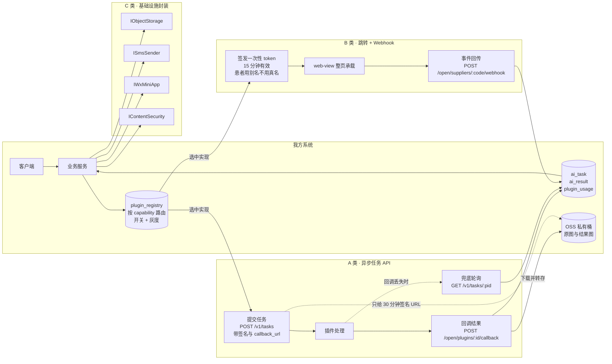

**为什么这么设计**：任一插件失败或合同终止，只要把 `plugin_registry.enabled` 置为 false，对应入口自动隐藏，主流程不受影响。同一 `capability` 可以注册多个实现，换供应商不改业务代码。所有外部调用写 `plugin_usage` 计量，便于月度对账。

十四个插件的归属：

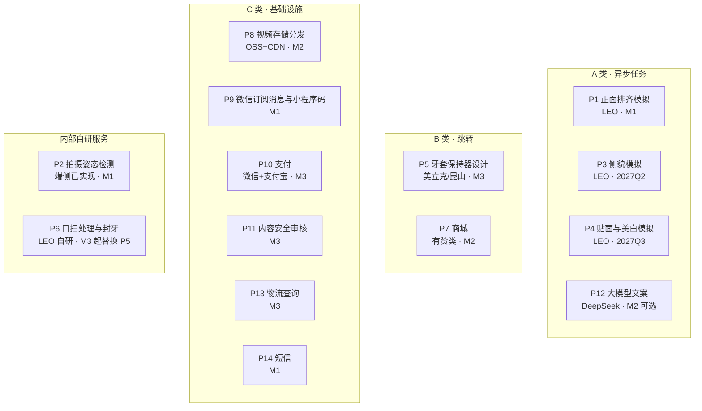

---

## 12. 部署拓扑与数据流

一台阿里云 ECS 上的 Docker Compose，加 OSS 双桶与 CDN。注意内网端点与公网端点的区别，这是省流量费的关键。

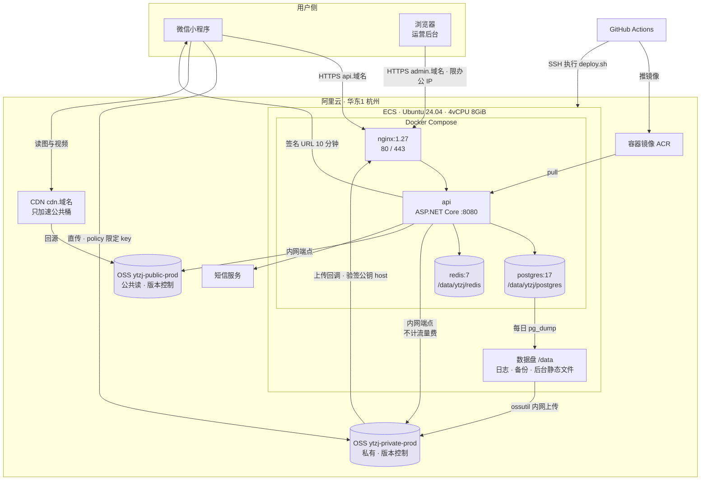

**三条容易出错的边**

| 边 | 要点 |
| --- | --- |
| 服务端访问 OSS | 必须用内网端点 `oss-cn-hangzhou-internal.aliyuncs.com`，走公网端点会白白产生流量费 |
| OSS 上传回调 | 必须校验 `x-oss-pub-key-url` 的 host 是 `gosspublic.alicdn.com`，否则任何人都能伪造上传完成 |
| CDN 防盗链 | 必须允许空 Referer，小程序内请求的 Referer 可能为空，不允许的话图片全部裂开 |

私有桶不接 CDN。医疗影像量小，签名 URL 直连 OSS 即可，接 CDN 会引入鉴权复杂度和缓存泄露风险。

---

## 13. 小程序分包结构

微信主包上限 2MB，所以只有五个 tab 页和登录协议放主包，其余按业务域拆分包，首页加载后预下载模拟与自测两个包。

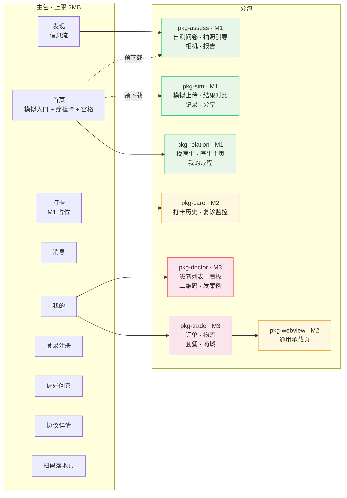

现有代码迁移：`pages/selftest/*` 与 `pages/report/*` 整体搬进 `pkg-assess` 只改导入路径；`pages/content/*` 改造为主包的发现页；底部 tab 从四项变五项，`utils/tabbar.ts` 里硬编码的 0 到 3 索引要同步改。

---

## 14. 核心业务链路：从扫码到下单

前面十三张图是静态结构，这张图是数据实际怎么流动的。它串起了五个 schema 和三类插件，是验收 M1 的主线。

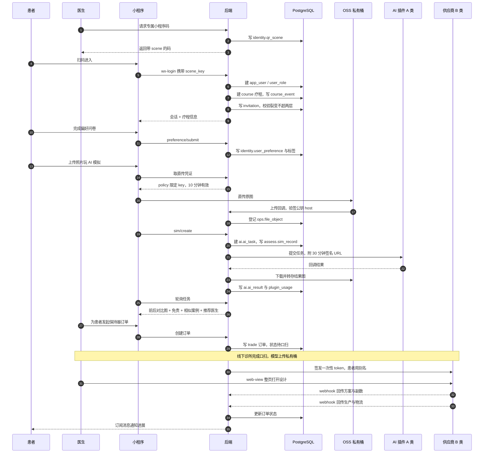

这条链路里有三处必须做幂等：AI 任务创建按 `idempotency_key`、插件回调按 `task_id`、供应商 webhook 按 `供应商编码 + 外部单号 + 事件` 三元组。

---

## 15. 两张图怎么用

| 场景 | 看哪张 |
| --- | --- |
| 建库写迁移 | §2 到 §7 的详图，配合 DDL 文件 |
| 评估一个改动的影响面 | §1 总览，先看是否触及 `app_user` 或 `course` |
| 写一个新接口 | §10 模块依赖，确认没有跨域直查 |
| 接一个新的外部能力 | §11 插件三类协议，选形状 |
| 排查线上问题 | §12 部署拓扑，按边逐段排查 |
| 排小程序开发顺序 | §13 分包结构，看里程碑配色 |
| 验收 M1 | §14 业务链路，逐步走通 |

图与 DDL 必须同步更新。任何 `ALTER TABLE` 都要回到 §2 到 §7 改对应的 erDiagram，否则图很快就会变成误导。建议把这条写进代码评审清单。

---

## 16. 与其它文档的口径差异

画图时把五份文档逐条对了一遍，发现四处互相打架的地方。图一律以 DDL 与 M0 详细设计为准，这里把差异列出来，避免有人照着旧文档开发。

| 差异点 | `03_小程序平台架构设计.md` 的说法 | 本图册与 DDL 的说法 | 结论 |
| --- | --- | --- | --- |
| 分库方式 | 四处写「按域分物理库」 | 单实例单库 `ytzj`，一域一 schema | 以 ADR-003 为准。03 写于 M0 之前，尚未收敛 |
| 域的划分 | 列 10 个域，含「疗程与病例」「商城适配」 | 9 个 schema，疗程在 identity，问卷在 assess | 以 DDL 为准 |
| 表名 | 用 `user`、`comment`、`moderation`、`ad_slot`、`questionnaire` | `identity.app_user`、`content.post_comment`、`content.moderation_log`、`ops.banner`、`assess.template` | 以 DDL 为准 |
| 医生网页端时间 | 「第二步上线」 | 第二步是 2027-04 至 2027-12 那根轴 | 不是 M2。M0 到 M4 是 2026-09 至 2027-03 的开发里程碑，三步走是业务阶段，两根轴差了半年，本图册 §9 已按「第二步 2027」标注 |

另有两处需要产品经理确认，不是文档错误而是尚未定：

1. **分包清单在三处不一致**。`05` 的目录树列 6 个分包，`8.1` 的表格列 8 个，`8.2` 的页面清单里 `pkg-content` 注明「放主包或 pkg-relation，视体积定」。本图册 §13 按 `8.1` 的表格画，`pkg-content` 未单独成包。
2. **M1 到底有没有机器审核**。开发路线图把内容安全审核排在 M3，但 DDL 的种子数据在 M1 就写入了 `wx-content-security` 且 `enabled=true`，而 `content.post` 默认 `pending` 也意味着 M1 就需要审核动作。要么把插件提前到 M1，要么 M1 用人工审核并把种子的开关置为 false。
