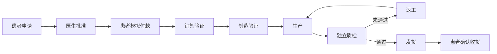

# Smilelab 单一订单工作流

平台 PostgreSQL 的 `dso_order` 是唯一订单状态源；`dso_order_event` 是只追加历程，`dso_order_payment` 是只追加模拟付款凭证。所有参与者查看同一个永久订单编号和版本。Odoo 仅有只读商业镜像，不能另行编辑订单进度；集成失败不改变平台已提交状态。



## 使用入口

打开 https://app.smilelab.ai/workspace/ ，选择患者、医生、订单销售、制造人员或独立质检。患者输入开发密钥和固定 `demo:` 测试标识；员工输入单独交付的各自密钥。门诊经理可以查看进度，但不能替代医生批准、患者付款或独立质检。只使用合成资料。

患者的「共享订单 → 发起申请」选择医生与演示保持器产品，填写说明及收货信息。医生打开同编号订单，确认制造要求；患者明确确认模拟付款；销售、制造及质检按页面显示的允许操作继续。所有订单详情每5秒自动刷新，显示当前阶段、下一责任人、版本、付款凭证、物流和完整时间线。可用 `https://app.smilelab.ai/workspace/?order=<订单编号>` 定位同一订单，登录后仍校验资源权限。

## API

员工使用 `/api/dso/v1`；患者也可使用 `/api/v1`。成功响应为 `{code:0,message:"ok",data:...}`。所有创建及操作需要 `Idempotency-Key`，操作正文需要最新 `version`。重复同键同正文不会再收费、再生产或再写事件，返回当前快照；改正文返回409。409后刷新并让操作者重新确认。金额单位是分，来自服务器产品目录的冻结快照，客户端不能提交价格。

| 接口 | 功能 |
|---|---|
| GET `/orders/products` | 演示产品与价格 |
| POST `/orders` | 患者申请 |
| GET `/orders` | 当前角色有权查看的分页订单 |
| GET `/orders/{id}` | 当前快照、允许操作、下一责任人、付款与完整历程 |
| POST `/orders/{id}/actions/{action}` | 按角色、阶段和版本执行操作 |

申请示例：

```json
{"doctorId":"d_001","productCode":"retainer_pair","quantity":1,"requestText":"合成演示申请","shippingAddress":{"recipient":"测试收件人","phone":"000000","address":"测试地址"}}
```

| action | 角色 | 前置阶段 | 除version外的正文 | 结果 |
|---|---|---|---|---|
| doctor_approve | 指定医生 | requested | productionSpec | pending_payment |
| doctor_reject | 指定医生 | requested | reason | rejected |
| pay_demo | 本人患者 | pending_payment | confirmSimulation:true | paid |
| sales_validate | sales | paid | 无 | sales_validated |
| manufacturer_validate | manufacturer | sales_validated | 无 | manufacturing_ready |
| start_manufacturing | manufacturer | manufacturing_ready/rework_required | batchRef | manufacturing |
| finish_manufacturing | manufacturer | manufacturing | 无 | qa_pending |
| qa_pass | quality | qa_pending | checks全部true | qa_passed |
| qa_fail | quality | qa_pending | checks至少一项false、reason | rework_required |
| ship | manufacturer | qa_passed | carrier、trackingNumber | shipped |
| confirm_delivery | 本人患者 | shipped | 无 | delivered |
| cancel | 本人患者 | requested/pending_payment | 无 | cancelled |

质检checks包含 `identity,specification,finish,packaging` 四项，全部必须显式填写。即使一个员工拥有制造和质检两个角色，也不能检验自己最后完成的生产。医生批准后制造要求冻结。付款后暂不提供取消/退款入口，避免把无退款能力的操作表示成完整售后。

## 可见性和集成

患者只看本人订单，医生只看本人被指定且仍为活动医生的订单，销售/制造/质检与管理人员只看当前获授权门诊订单。订单申请明确指定医生，但不会自动授予患者完整临床病历访问权。

申请说明及医生拒绝的具体原因仅给患者和指定医生。制造人员和质检看到批准的制造要求；销售/经理/运维不获取该要求。收货信息仅给患者、销售及制造发货人员。各角色都得到不含病历正文的进度事件。页面/接口中的可见操作由服务器计算，前端隐藏按钮不代替权限验证。

每次更新与 `order.snapshot` outbox 事件同事务提交。Odoo `chipmunk.order` 镜像只接收编号、版本、阶段、产品代码、数量、演示金额/币种和付款模式，不接收姓名、申请说明、制造要求或收货信息。乱序旧版本不能覆盖较新镜像，同版本不同内容报告冲突。Odoo 菜单：花栗鼠商业集成 → 订单只读镜像，金额字段单位为分。

## 演示边界

本轮已授权使用模拟付款，明确显示不扣款。API同时要求 `DEMO_AUTH=true`、`PAYMENT_MODE=demo`（未设置时开发默认demo）及 `confirmSimulation:true`。没有真实支付、退款、发票记账、外部物流查询或 CAD/口扫文件提交；制造与物流是角色手动登记的演示操作，不等同于实际工厂设备执行或物流签收证明。独立工厂租户及多供应商分配尚未实现，本轮制造账号是获授权的同门诊演示人员。

`packages/smilelab-client/src/uni.ts` 提供 requestOrder/order/orders/payDemo/confirmDelivery，沿用当前会话和幂等键。浏览器患者演示入口用于验证本次流程，完整微信小程序 UI 仍需后续开发。
